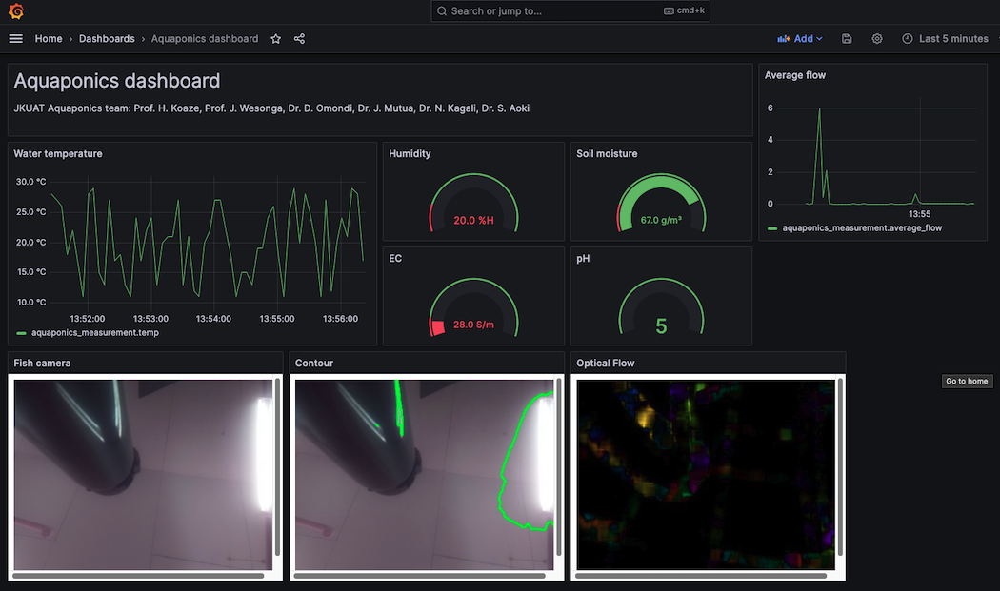

## Aquaponics dashboard
powered by ROS, InfluxDB, Grafana



## Connection 
Connect Arduino and Raspberry Pi via USB cable

## Launch ROS server
```
$ roscore
```
## Launch serial subscriber 
```
$ rosrun rosserial_python serial_node.py /dev/ttyACM0
```
## Launch server
```
$ cd script
$ python server.py
```

## Launch camera server
**1st camera (RAW image)**

streamed on <IP>:5000/stream

```
$ cd camera/camera_streaming
$ python app.py
```

**2nd camera (Contour detection)**

streamed on <IP>:5003/stream

```
$ cd camera/camera_contour
$ python app.py
```


**3rd camera (Optical flow)**

streamed on <IP>:5001/stream

```
$ cd camera/camera_optical_flow
$ python app.py
```


## Install InfluxDB (server and python client) and Grafana
```
$ sudo apt-get install influxdb2
$ pip3 install influxdb-client
$ sudo apt install grafana
```

## Launch InfluxDB (at :8086)
```
$ sudo  systemctl unmask influxdb
$ sudo  systemctl start influxdb
```
## Launch Grafana (at :3000)
```
$ sudo systemctl start grafana-server
```

